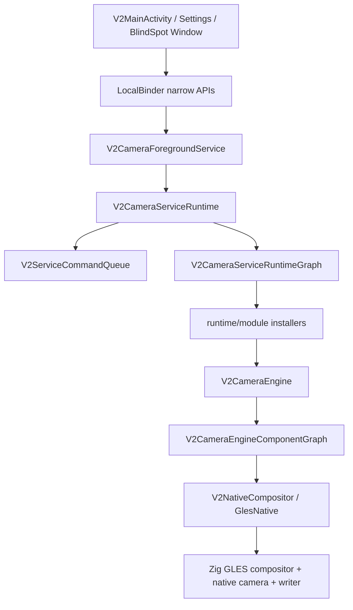

# EVCam

EVCam 是面向吉利银河车机的 V2 行车记录仪应用。当前主线是 Kotlin V2 架构，应用通过前台服务驱动多路车载摄像头预览、录制、补盲小窗、鱼眼矫正、避让、开机自启和保活。

> 旧版 Java 单 Activity / 远程机器人架构已经不是当前主线。请以 `app/src/main/kotlin/com/kooo/evcam/v2` 和 `core/model/src/main/kotlin/com/kooo/evcam/v2` 为准。

## 当前状态

- App namespace: `com.kooo.evcam`
- Installed applicationId: `com.kooo.evcam.v2`
- Main modules: `:app`, `:core:model`
- Current versionName: `2.0.0-test-05091501`
- Minimum SDK: 28
- Target / compile SDK: 36
- Native ABI: `arm64-v8a`
- Release signing: `keystore/release.jks` with configured test credentials

## Features

- Four-camera composite preview and segmented H.264 recording.
- Zig native GLES compositor with EGL/OES input, preview worker, encoder surface rendering, and native segment writer.
- Main preview, fisheye preview, and blind-spot preview surface ownership with priority handling.
- Independent preview/recording fisheye parameters and blind-spot fisheye parameters.
- Blind-spot small-window preview driven by turn-signal VHAL events.
- Blind-spot overlay correction, including scale, translation, and rotation tuning.
- Foreground-app avoidance: hide UI, stop/restore recording, hide blind spot, and auto-record recovery.
- Display power handling for screen off/on, camera release/reconnect, and delayed recording restore.
- Foreground service, boot receiver, keep-alive worker/provider/receiver, wake lock, and accessibility keep-alive.
- Flyme Auto status bar plugin integration and custom-key VHAL control.
- Playback list/cache and storage cleanup.
- Settings pages for vehicle model, permissions, startup, recording, storage cleanup, custom key, avoidance, fisheye, and blind spot.

## Supported Vehicle Presets

Current presets live in `V2VehicleModelSettings`:

| Preset | Front | Back | Left | Right |
| --- | --- | --- | --- | --- |
| `25款E5` | `2` | `1` | `3` | `0` |
| `26款星舰7` | `3` | `2` | `4` | `1` |
| `25款A7` | `2` | `1` | `3` | `0` |

Default preset: `25款A7`.

## Build Requirements

- JDK 17+
- Android Gradle Plugin 9.0.0
- Gradle wrapper 9.1.0
- Android SDK / build tools for compile SDK 36
- Android NDK `28.2.13676358`
- CMake `3.22.1`
- `zig` available on `PATH`

Native build is required for `:app`. CMake invokes `zig build` under `app/src/main/zig`.

## Build Commands

macOS / Linux:

```bash
./gradlew :app:assembleDebug
./gradlew :app:assembleRelease
./gradlew :app:compileDebugKotlin
./gradlew :app:testDebugUnitTest :app:assembleDebug
```

Windows:

```bat
gradlew.bat :app:assembleDebug
gradlew.bat :app:assembleRelease
gradlew.bat :app:testDebugUnitTest
```

APK outputs:

```text
app/build/outputs/apk/debug/app-debug.apk
app/build/outputs/apk/release/app-release.apk
```

`release.bat` is Windows-only and interactive. It runs a clean release build, renames the APK, tags `v<versionName>`, and creates a GitHub release. Do not run it unless you explicitly want that release flow.

## Install And Debug

Install debug APK:

```bash
adb install -r app/build/outputs/apk/debug/app-debug.apk
```

Install release APK:

```bash
adb install -r app/build/outputs/apk/release/app-release.apk
```

Useful logs:

```bash
adb logcat -v time -s V2MainActivity:D V2CameraService:D V2AppLog:D AndroidRuntime:E
```

Camera hardware info:

```bash
adb shell dumpsys media.camera
```

Package id:

```bash
adb shell dumpsys package com.kooo.evcam.v2 | grep versionName
```

## Runtime Architecture

The current app is service-centered. UI classes bind to narrow service APIs; camera, preview, recording, display power, settings, keep-alive, VHAL, avoidance, and status reporting are composed inside the runtime graph.



Important boundaries:

- `V2CameraForegroundService`: Android foreground-service shell and Binder entrypoint.
- `V2CameraServiceApi`: narrow UI-facing interfaces for recording, visibility, main preview, and blind-spot preview.
- `V2CameraServiceRuntime`: public service operations serialized into the runtime graph.
- `V2ServiceCommandQueue`: single coarse-grained serializer for camera/recording/display/settings mutations.
- `V2CameraServiceRuntimeGraph`: service component registry wired by `service/runtime/module/*`.
- `V2CameraEngine`: facade over camera slots, native compositor, preview surfaces, recording controller, and status.
- `V2NativeCompositor` / `GlesNative`: Kotlin JNI bridge to the Zig compositor and recording worker.

## Preview And Recording Pipeline

Main preview:

```text
V2MainActivity
  -> V2MainPreviewBinder
  -> V2CameraServiceUiApi.attachCompositePreviewSurface
  -> V2CameraServiceRuntime
  -> V2CameraServicePreviewFacade
  -> V2CameraEngine
  -> V2NativeCompositor.attachCompositePreview
  -> Zig GLES composite preview worker
```

Blind-spot preview:

```text
VHAL turn signal
  -> V2BlindSpotController
  -> V2BlindSpotWindowCoordinator
  -> V2BlindSpotSmallWindowActivity
  -> V2BlindSpotPreviewServiceApi.attachBlindSpotPreviewSurface
  -> V2PreviewLeaseManager owner=BLIND_SPOT
  -> native preview surface using blind-spot fisheye params
  -> V2BlindSpotTransform overlay correction
```

Recording:

```text
V2RecordingOrchestrator
  -> V2CameraRecordingController
  -> V2RecordingPipelineFactory
  -> V2CompositeRecorder
  -> V2NativeRecordingBridge.startManagedRecording
  -> Zig GLES render to encoder surface
  -> AMediaCodec
  -> AMediaMuxer
  -> segmented MP4 files
```

There is no app-side Vulkan path in the current code. The active rendering/recording path is EGL + GLESv2 + OES textures + Android NDK media APIs.

## Source Layout

```text
app/src/main/kotlin/com/kooo/evcam/v2/
  service/
    V2CameraForegroundService.kt
    V2CameraServiceApi.kt
    runtime/
    runtime/module/
    camera/
    recording/
    preview/
    display/
    keepalive/
    avoidance/
    settings/
    status/
    vhal/
  ui/
    main/
    settings/
    blindspot/
    fisheye/
    playback/
  nativebridge/
  recording/
  storage/
  plugin/
  permissions/
  update/

core/model/src/main/kotlin/com/kooo/evcam/v2/
  service/
  settings/
  recording/
  storage/

app/src/main/zig/
  evcam_gles_compositor.zig
  evcam_writer.zig
  evcam_types.zig
  evcam_storage.zig
  evcam_playback_cache.zig
```

## Settings

The V2 settings screen is implemented in `V2SettingsActivity` and section classes under `ui/settings`.

Current setting groups:

- General: version, keep-alive status, vehicle model, permissions, logs, startup, auto recording.
- Recording: resolution, bitrate, FPS, segment duration.
- Storage cleanup: reserved space and cleanup policy.
- Custom key: VHAL property for vehicle button control.
- Avoidance: foreground target detection and behavior mask.
- Fisheye: preview/recording fisheye and blind-spot fisheye parameter groups.
- Blind spot: turn-signal property, overlay correction, window behavior.

Settings changes are sent through `V2CameraServiceCommands` and applied by `V2SettingsRuntimeCoordinator` while the service is running.

## Permissions And System Integration

The app uses camera, media/storage, foreground service, wake lock, boot, notification, overlay, usage stats, task access, accessibility keep-alive, Bluetooth state, Flyme Auto plugin, and vehicle/display broadcasts.

Be careful when changing `AndroidManifest.xml`; many entries are tied to vehicle runtime behavior:

- `V2CameraForegroundService`
- `V2BootReceiver`
- `V2KeepAliveReceiver`
- `V2KeepAliveProvider`
- `V2KeepAliveAccessibilityService`
- `V2DisplayPowerReceiver`
- `V2StatusBarPlugin`
- `V2StatusBarPluginReceiver`
- `V2BlindSpotSmallWindowActivity`

## Development Rules

- Keep business logic out of `V2MainActivity`; use service/runtime/UI helpers instead.
- Keep Android app logic in `:app`; shared DTO/settings models belong in `:core:model`.
- After code changes, update `app/build.gradle.kts` `versionName` using `-test-MMddHHmm`.
- Prefer narrow interfaces from `V2CameraServiceApi` for UI-service communication.
- Keep native bridge parameters structured on the Kotlin side before crossing JNI.
- For code changes, run at least:

```bash
./gradlew :app:compileDebugKotlin
./gradlew :app:testDebugUnitTest :app:assembleDebug
```

## Troubleshooting

Camera does not start:

- Check `adb shell dumpsys media.camera`.
- Verify the selected vehicle camera mapping.
- Check `V2CameraEngine` and native compositor logs.
- Confirm display power state did not release cameras.

Recording fails:

- Confirm all expected camera slots are open.
- Check storage path and available space.
- Check native errors from `V2NativeCompositor.lastError()`.
- Look for `V2CompositeRecorder` and `EVCamGLES` log lines.

Blind spot preview does not show:

- Confirm blind spot is enabled in settings.
- Confirm the turn-signal VHAL property and values.
- Check avoidance behavior; active avoidance can suppress blind-spot windows.
- Check `V2BlindSpotSmallWindow` and `V2CameraService` logs.

Fisheye changes do not appear:

- Confirm the correct parameter group: preview/recording fisheye vs blind-spot fisheye.
- Settings changes should flow through `ACTION_SETTINGS_CHANGED` and `V2SettingsRuntimeCoordinator`.
- Blind-spot preview uses the blind-spot fisheye arrays before UI overlay correction.

## License

GPL-3.0. See [LICENSE](LICENSE).
